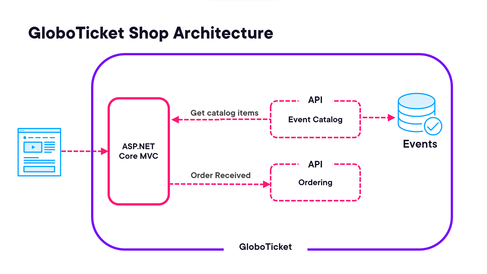

# GloboTicket Application

This application is the Globoticket website for the Global DevOps Experience! 

Read more info about the event from the website: [www.globaldevopsx.com](https://www.globaldevopsx.com/).

## Globoticket website
The Globoticket website looks as follows when used:


The website offers a way to buy tickets. You can select the quantity and check out.

## Globoticket Architecture
Globoticket uses two additional web API projects that provide an API for getting the catalog data and for registering the order when the order is completed.
This is shown in this architectural diagram below:



## Running locally
You can start the website. The webapps run locally on the ports:
- Catalog --> https://localhost:5016/swagger
- Ordering --> https://localhost:5293/swagger
- Frontend --> https://localhost:5266

The site uses a table storage top get events. To set up the connection, make sure you add the connectionstring to the appsettings.development.json or user secrets or environment variable, that points to the table storage. 

```
  "ConnectionStrings": {
    "EventsConnection": "BlobEndpoint=https://<storageaccountname>.blob.core.windows.net/;QueueEndpoint=https://<storageaccountname>.queue.core.windows.net/;FileEndpoint=https://<storageaccountname>.file.core.windows.net/;TableEndpoint=https://<storageaccountname>.table.core.windows.net/;SharedAccessSignature=se=2024-12-31&sp=rdlau&sv=2022-11-02&ss=qfbt&srt=<signature>"
  }
```

You can also choose to use the inMemory sample events, by changing the Repository in the Catalog Service. For that, open Program.cs and change the folowing lines to use the InMemoryEventRepository

```csharp
//builder.Services.AddTransient<IEventRepository, AzureStorageEventRepository>();
builder.Services.AddTransient<IEventRepository, InMemoryEventRepository>();
```


